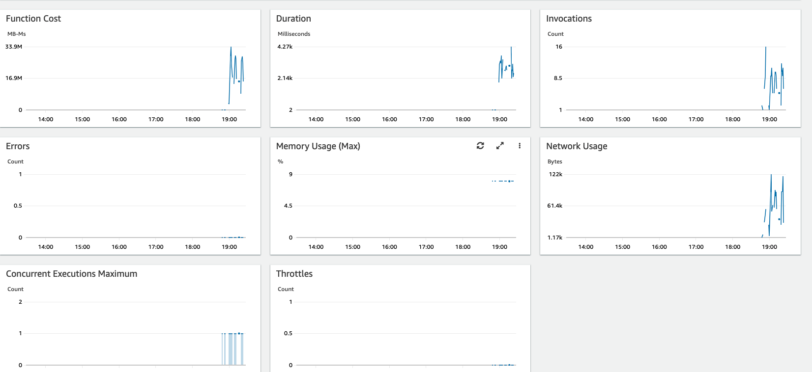

# aws-serverless-lambda-insights
Lambda Insights collects several metrics from the Lambda functions where it is installed. Some of these metrics are available as time series aggregated data in CloudWatch Metrics. Other metrics are not aggregated into time series data but can be found in the embedded metric format log entries by using CloudWatch Logs Insights.


The way to do it was to add the correct ARNs based on this site: https://docs.aws.amazon.com/AmazonCloudWatch/latest/monitoring/Lambda-Insights-extension-versions.html

Here you can see the following metrics: https://docs.aws.amazon.com/AmazonCloudWatch/latest/monitoring/Lambda-Insights-metrics.html

To deploy:
```
sls deploy
sls invoke -f hello
./invoke-lambda.sh
```

The hello function has a random sleep from 1 - 5000 ms.  This should show the delay within the response.  It also returns different response codes (200, 202, 400, 404, and 500)

You will see the messages below and you can check the dashboard here: https://console.aws.amazon.com/cloudwatch/home?region=us-east-1#lambda-insights:performance



```
./invoke-lambda.sh 
{
    "statusCode": 500,
    "body": "{\n  \"message\": \"There was some random error\",\n  \"millisecondsDelay\": 3666\n}"
}
(node:72679) ExperimentalWarning: Conditional exports is an experimental feature. This feature could change at any time
{
    "statusCode": 404,
    "body": "{\n  \"message\": \"Your function executed successfully!\",\n  \"millisecondsDelay\": 4217\n}"
}
(node:72681) ExperimentalWarning: Conditional exports is an experimental feature. This feature could change at any time
{
    "statusCode": 400,
    "body": "{\n  \"message\": \"Your function executed successfully!\",\n  \"millisecondsDelay\": 1653\n}"
}
(node:72684) ExperimentalWarning: Conditional exports is an experimental feature. This feature could change at any time
{
    "statusCode": 500,
    "body": "{\n  \"message\": \"There was some random error\",\n  \"millisecondsDelay\": 1246\n}"
}
(node:72686) ExperimentalWarning: Conditional exports is an experimental feature. This feature could change at any time
{
    "statusCode": 400,
    "body": "{\n  \"message\": \"Your function executed successfully!\",\n  \"millisecondsDelay\": 274\n}"
}
```